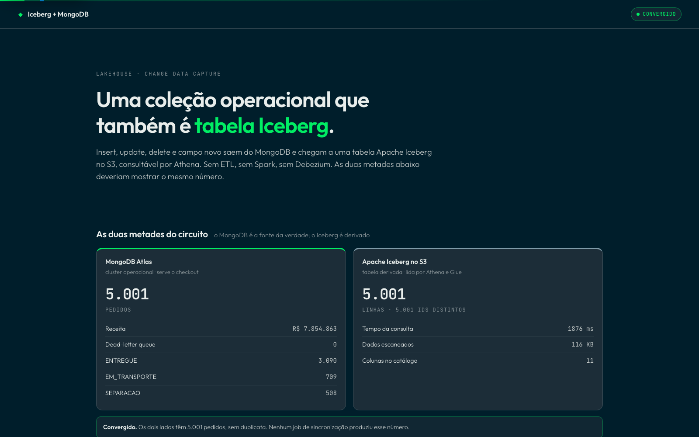
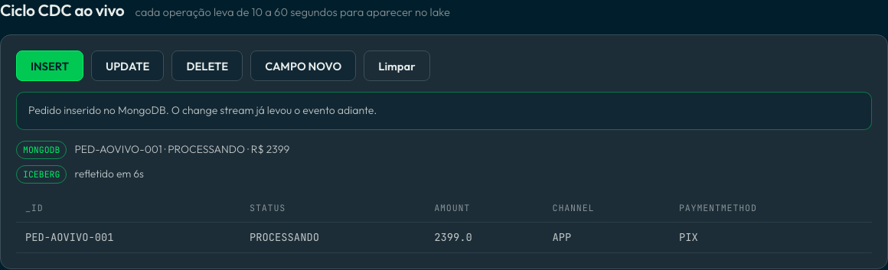
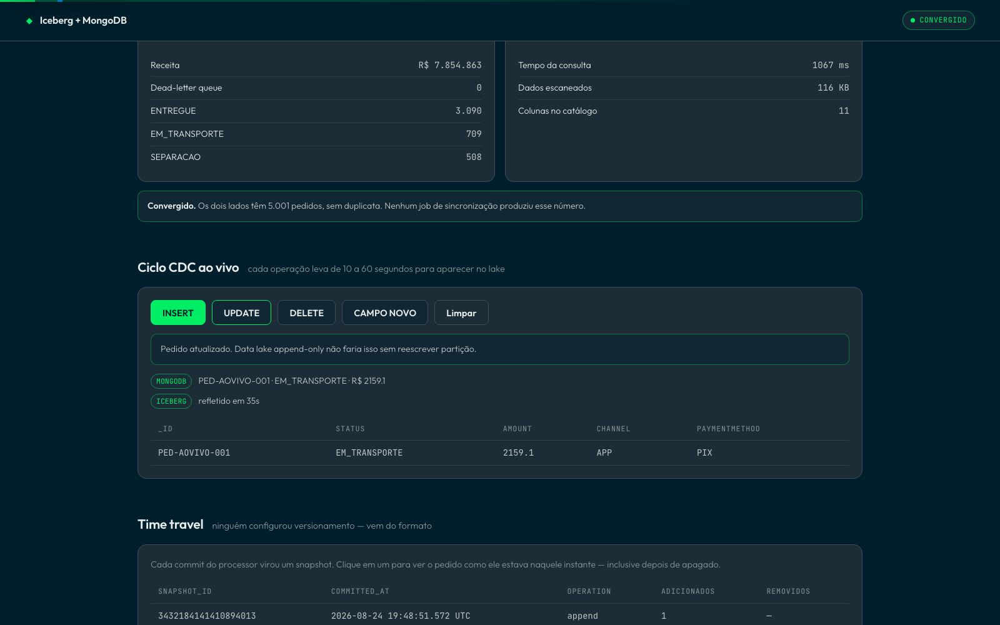
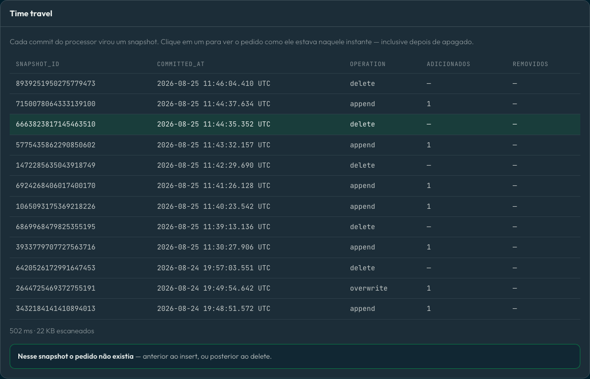
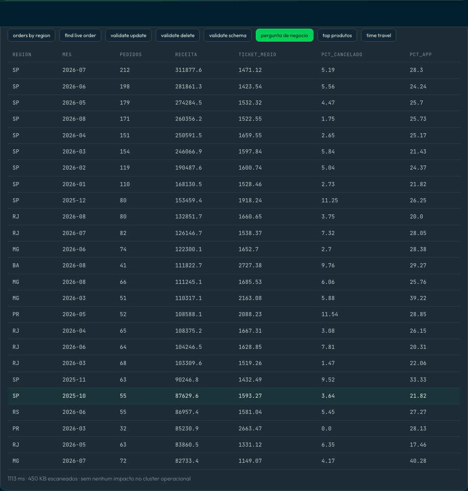

# Iceberg + MongoDB

Operational data lives in MongoDB. Analytics lives in the lake. Keeping the two
in sync is usually a pipeline someone owns: Debezium, Kafka, Spark jobs, a
nightly batch that drifts.

This demo removes that pipeline. An Atlas collection is mirrored into an Apache
Iceberg table on S3 by Atlas Stream Processing, catalogued in AWS Glue and
queried from Athena. Inserts, updates, deletes and new fields propagate on their
own — including the two a traditional append-only lake struggles with.

> MongoDB Atlas → Atlas Stream Processing → Iceberg on S3 → Glue → Athena

Measured against a real cluster and a real bucket: **5,000 orders on both sides,
inserts visible in ~10s, updates in ~20s, deletes in 30-60s.**

---

## The demo

### 1. Two halves of one circuit

The operational cluster and the derived table, side by side. Same count, no
synchronisation job produced it.



### 2. An order enters through the transactional path

`INSERT` writes to MongoDB. The change stream carries it; the UI times how long
the row takes to appear in Iceberg — 6 seconds in the run below, and up to a
minute depending on where the write lands relative to the processor's commit.



### 3. The update lands in the lake

Status and amount change in MongoDB and the Iceberg row follows. This is the
step that matters: an append-only lake would need a partition rewrite.



Delete works the same way — the row disappears from the table. For regulated
industries that is the right-to-be-forgotten reaching the lake without a
compaction job.

### 4. Time travel comes free with the format

Every processor commit is an Iceberg snapshot. Click one and the order comes
back as it was at that instant, even after being deleted from MongoDB. Nobody
configured versioning.



### 5. The question nobody runs on the operational cluster

Revenue by state and month, ticket size, cancellation rate, app share — 18
months of history scanned on S3, with the cluster untouched.



A new field (`fraudScore`) becomes a column in the Glue catalogue with no
migration, and older rows read as `NULL`.

---

## Setup

Requires an Atlas cluster, an Atlas Stream Processing workspace, an S3 bucket, a
Glue database and an IAM role trusted by Atlas.

```bash
# 1. AWS: bucket and Glue database (the IAM role and its policy are manual)
AWS_REGION=<region> S3_BUCKET=<bucket> bash setup/aws/bootstrap.sh

# 2. credentials
cp .env.example .env    # fill in MONGODB_URI, S3_BUCKET, AWS_REGION

# 3. python
python3 -m venv .venv && ./.venv/bin/pip install -r requirements.txt
./.venv/bin/python scripts/preflight.py     # validates and fixes the MongoDB side
./.venv/bin/python scripts/seed_orders.py   # 5,000 reproducible orders

# 4. the stream processor, from mongosh connected to the workspace
#    edit the constants at the top of the file first
load("stream-processing/create_processor.js")
```

## Running the UI

```bash
cd backend && python3 -m venv venv && ./venv/bin/pip install -r requirements.txt
cd ../frontend && npm install
cd .. && ./start.sh          # backend :8250, frontend :5250
```

The Iceberg panels need AWS credentials; without them the MongoDB side keeps
working and the UI says what is missing.

## Driving the demo from the CLI

```bash
./.venv/bin/python scripts/insert_order.py
./.venv/bin/python scripts/update_order.py
./.venv/bin/python scripts/delete_order.py
./.venv/bin/python scripts/add_schema_field.py
./.venv/bin/python scripts/reset_demo.py
./.venv/bin/python scripts/compare_aggregation.py   # same aggregation on the cluster, timed
```

Athena queries live in `sql/`, from per-step validation to the business question
and the time travel snippets.

## Adversarial tests

```bash
backend/venv/bin/pip install -r backend/requirements-dev.txt
backend/venv/bin/pytest -q backend/tests
```

The suite rejects malformed or oversized order IDs, SQL-like snapshot values and
query traversal before MongoDB, Athena or the filesystem is touched. Snapshot IDs
are positive bounded integers; order and query IDs use an explicit allowlist.

## Before every demo

```bash
./.venv/bin/python scripts/preflight.py
```

It checks the connection, enables `changeStreamPreAndPostImages` when missing,
reports the dead-letter queue and flags expired AWS credentials.

## Things that break it

`docs/TROUBLESHOOTING.md` documents nine failures found while building this
against real infrastructure, with symptom and cure. The ones worth knowing up
front:

| Symptom | Cause |
|---|---|
| Processor dies on the first UPDATE | source collection has no post-images |
| Duplicate rows in Athena | a restart without a checkpoint re-runs `initialSync`, which inserts rather than upserts |
| A document never arrives | `Decimal128` or a type conflict — check `iceberg_demo.dlq` |
| Processor fails and the DLQ is empty | a field name containing `.`; Iceberg column names are stricter than MongoDB's |

---

Based on [mongodb-developer/Iceberg-MongoDB-Demo](https://github.com/mongodb-developer/Iceberg-MongoDB-Demo),
hardened against a live environment: credentials moved to `.env`, a dead-letter
queue, a preflight script, the business and time travel queries, and a UI.
